# Laporan Praktikum Flutter
## Nama : Hikmal Maulana Fajar
## NIM 230444040008
## Kelas : 04421

## Praktikum 1: Membuat Project Flutter Baru
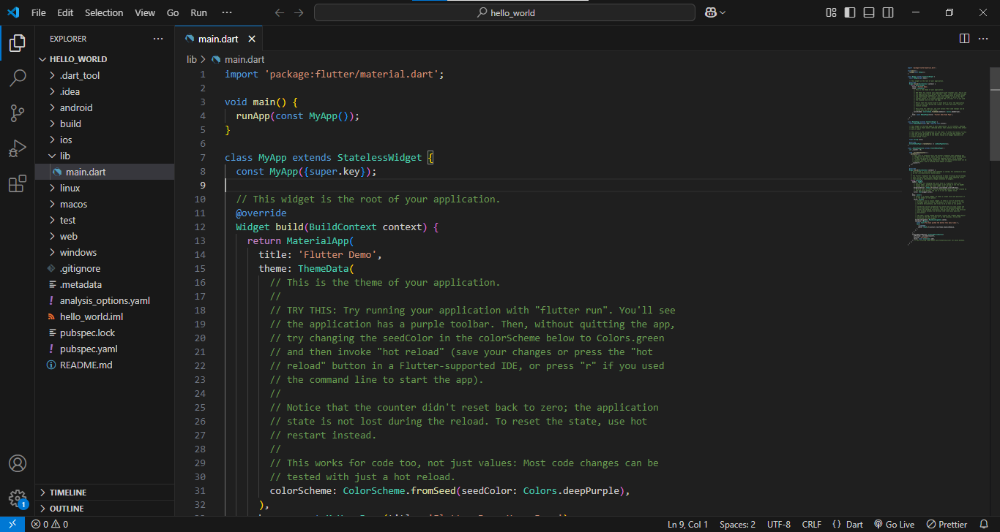

## Praktikum 2: Menjalankan Aplikasi di Perangkat Fisik
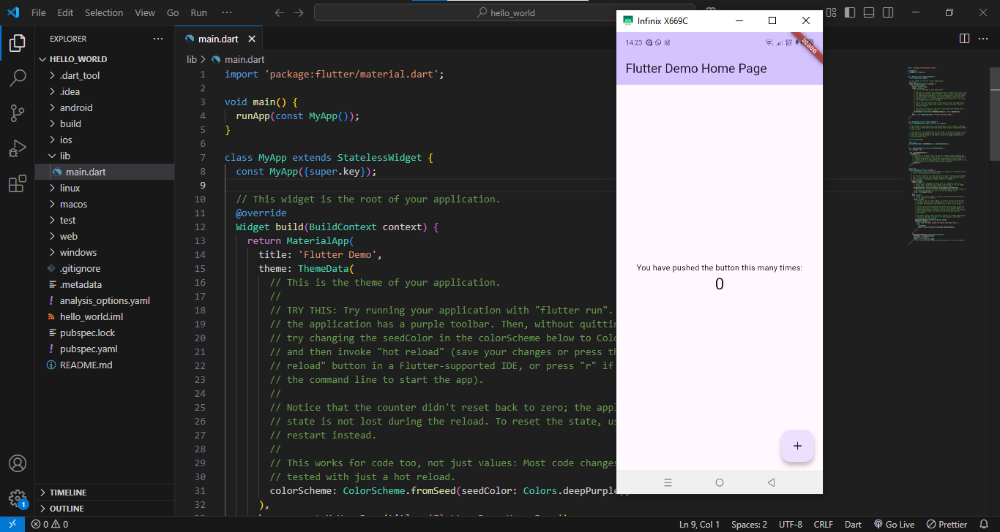

## Praktikum 3: Menggunakan GitHub
- Link Repository: [GitHub Repository](https://github.com/HikmalMaulanaFajar/flutter-fundamental-latih1)
- Menganti Nama Pada Aplikasi hello_world :
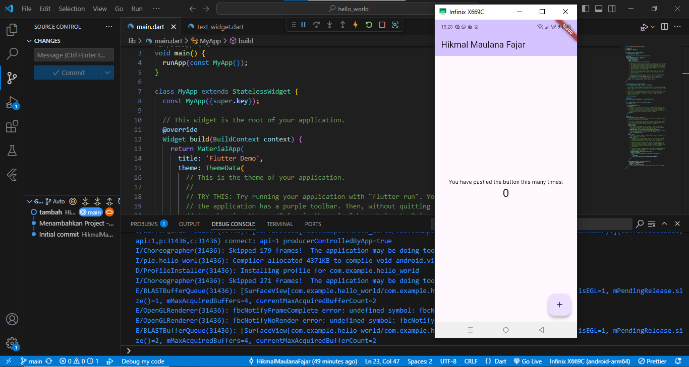
- Menganti Isi File Redmi.md dan Menampilkan gambar :

## Praktikum 4: Widget Dasar
- Mengubah Text Widget
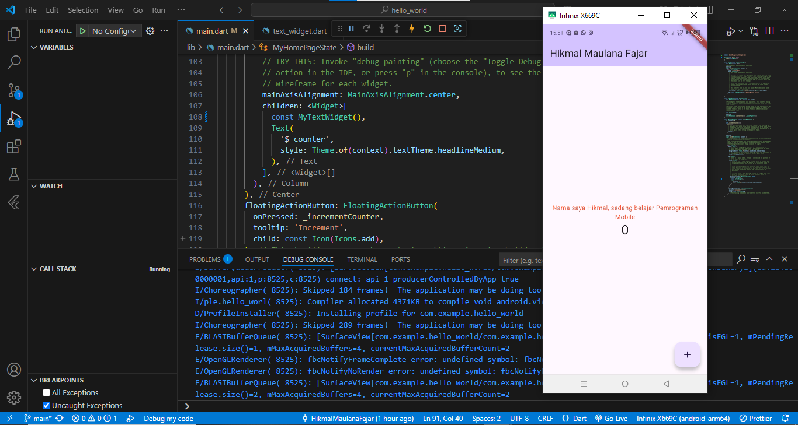
- Menggunakan Image Widget
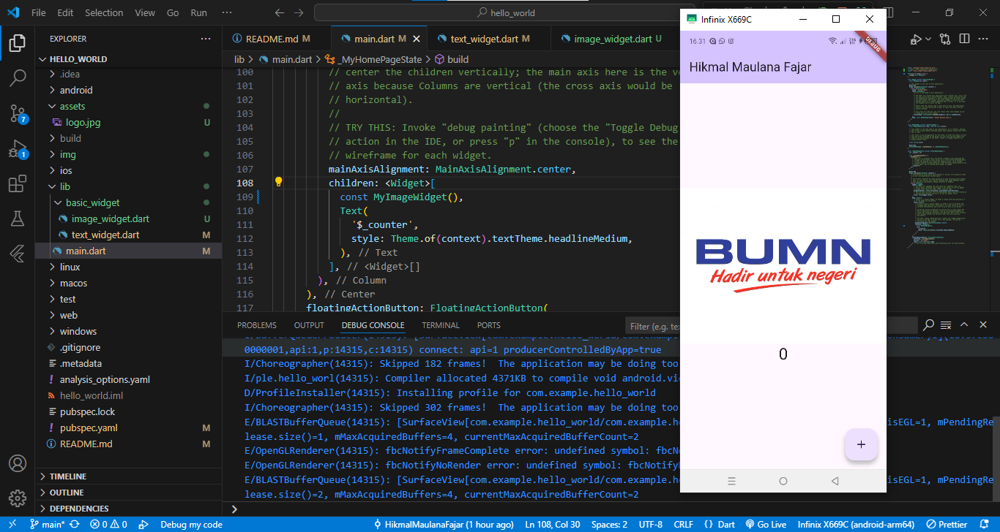

## Praktikum 5: Material Widget
- Menggunakan Cupertino Button & Loading Bar
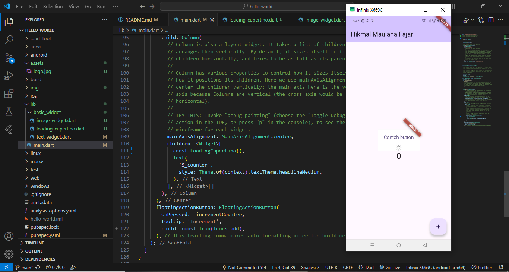

- Menggunakan Floating Action Button
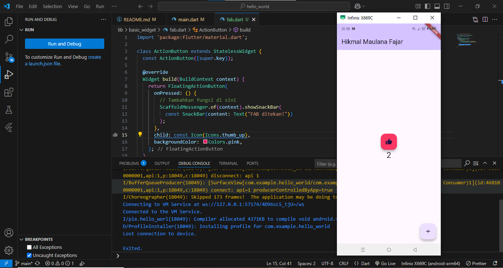

- Menggunakan Scaffold Widget
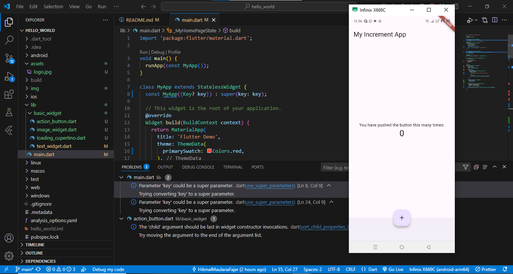

- Menggunakan Dialog Widget
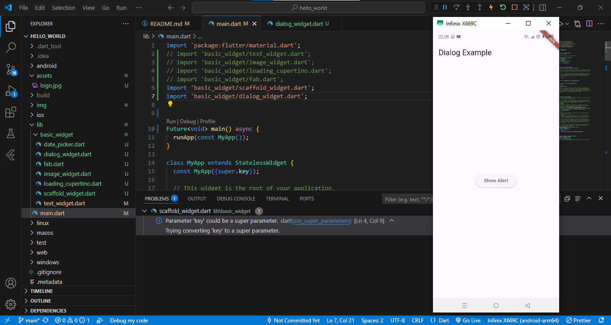

- Menggunakan Selction Widget
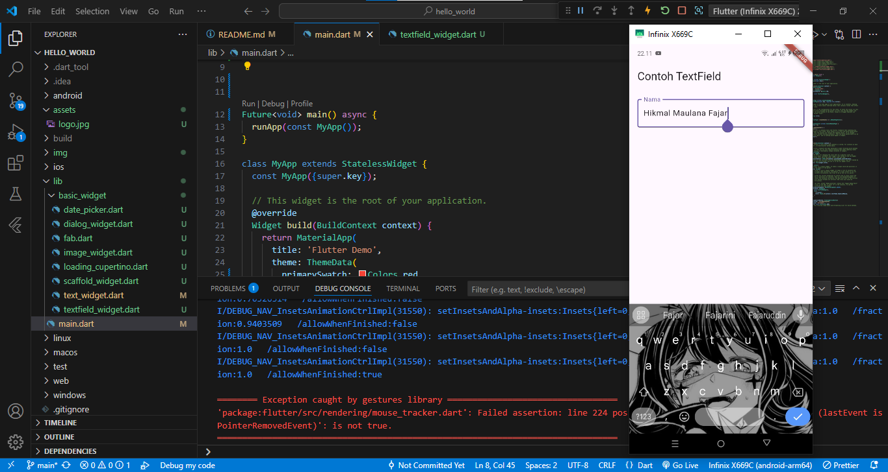

- Menggunakan Date & Time Picker
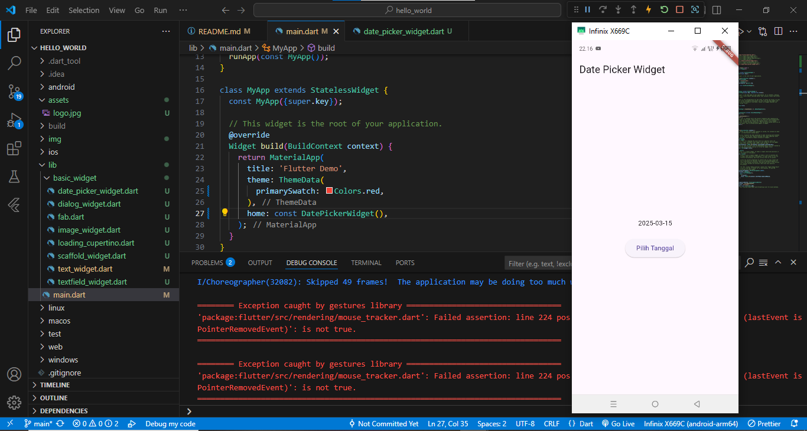
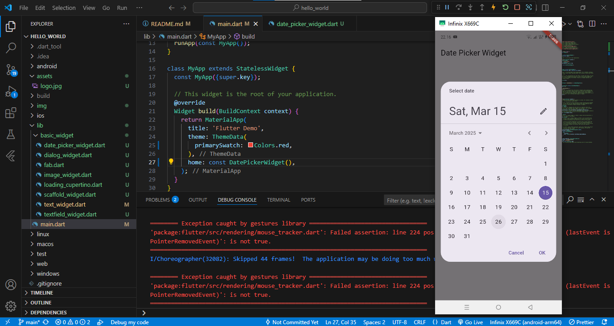