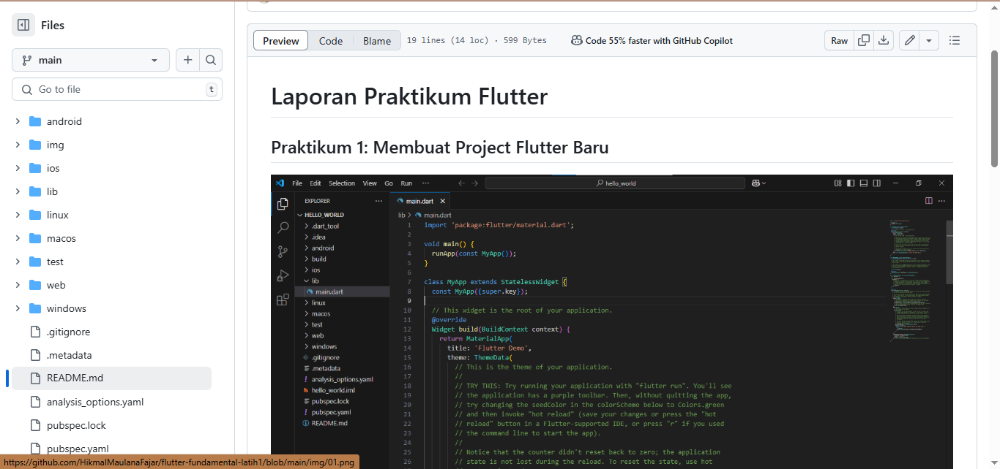

# Laporan Praktikum Flutter

## Praktikum 1: Membuat Project Flutter Baru

## Praktikum 2: Menjalankan Aplikasi di Perangkat Fisik

## Praktikum 3: Menggunakan GitHub
- Link Repository: [GitHub Repository](https://github.com/HikmalMaulanaFajar/flutter-fundamental-latih1)
- [Menganti Nama Pada Aplikasi hello_world](img/03.png)

## Praktikum 4: Widget Dasar

## Praktikum 5: Material & Cupertino Widgets

